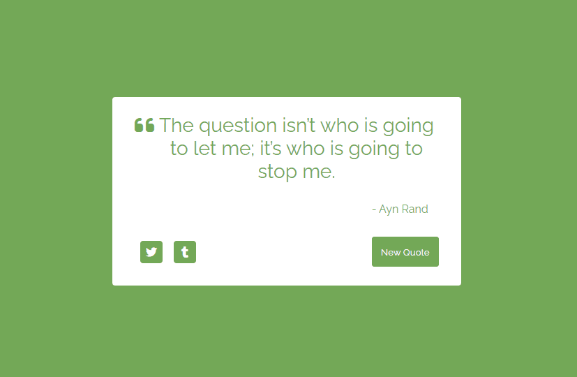
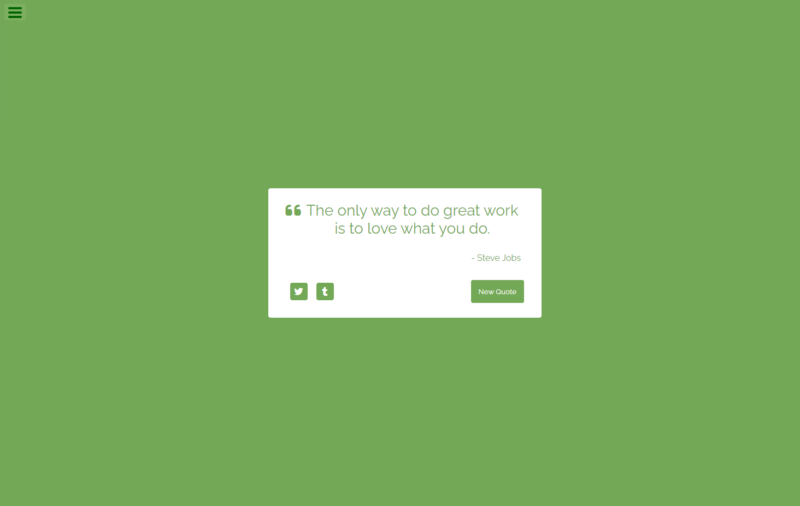

# React Random Quote Generator

React project built for
[FreeCodeCamp's front-end development libraries certification](https://www.freecodecamp.org/learn/front-end-development-libraries/front-end-development-libraries-projects/build-a-random-quote-machine)

## Usage

The purpose of this project was to build a random quote generator using React
that utilises a 3rd party/API to get quotes from. The colour will also change
when a quote is changed

## Tech Stack

**Client:** HTML5, CSS3, JavaScript, React

## Authors

- [@haylzrandom - Github](https://www.github.com/haylzrandom)
- [@haylzrandom - FreeCodeCamp](https://www.freecodecamp.org/haylzrandom)

## Demo

## Screenshots

## License

[MIT](https://choosealicense.com/licenses/mit/)
